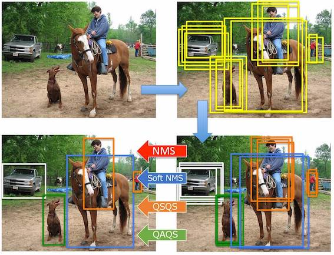

# QAQS

    QAQS: Quantum Appearance QUBO Suppression

<div align="center">

</div>

## Usage

### 1. Object detection without suppression

```
python detect.py -d <dataset name> -n <n_examples> -b <batch size>
```

For example:

```
python detect.py -m yolov5l -d coco2017 -n 100 -b 10
```

### 2. Run suppression algorithm

```
python main.py -c <config path> -r <detection csv> -p <params to override>
```

For example:

```
python main.py -c ../config/nms_algorithm.yaml  -r ../storage/data/coco2017/detections_100.csv -p thread=2
```

### 3. Visualize detection

```
python visualize.py -r <csv path>
```

For example:

```
python visualize.py -r ../result/coco2017/NMS_Algorithm1/result.csv
```
